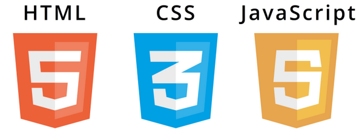

# Week 1

Hello! Welcome to COMP6080 - Web frontend programming! :)

### Today...

🏡 Admin + Housekeeping

🚀 Introduction to Frontend Programming

🛠️ HTML + CSS

## Course Info

**Course Website**: https://cgi.cse.unsw.edu.au/~cs6080/25T3. For all course content and info including lectures, tutorials, assignments etc.

**GitLab**: Where you can find tutorial exercises and where you will be completing your assignment work.

### Where to get help?

- **Help Sessions**: https://cgi.cse.unsw.edu.au/~cs6080/25T3/timetable/help-sessions
- **Discourse Forum**: https://discourse02.cse.unsw.edu.au/25T3/COMP6080/
- **Me**: z5310488@ad.unsw.edu.au
- **Course Email**: cs6080@cse.unsw.edu.au

## Introduction to Frontend Programming



3 building blocks of frontend development:

1. **HTML** (HyperText Markup Language): defines the content and structure of a webpage.
2. **CSS** (Cascading Style Sheets): used to add style to your HTML documents.
3. **JavaScript**: makes your webpage dynamic.

A web browser is a tool that processes HTML, CSS, JS (and more) and renders it for us to see.

## HTML Basics

HTML defines the structure of a webpage.

### Syntax:

```html
<tag attr1="value1" attr2="value2">Stuff</tag>
```

Here is a simple HTML document, it consists of various HTML tags:

```html
<!-- Specifies an html document -->
<!DOCTYPE html>
<html>
  <!-- Contains metadata -->
  <head lang="en">
    <title>Title</title>
    <meta charset="utf-8" />
    <link rel="icon" href="favicon.ico" />
    <meta name="description" content="Course website for COMP6080" />
    <link rel="stylesheet" type="text/css" href="styles.css" />
    <script type="text/javascript" src="script.js"></script>
  </head>
  <!-- What actually gets rendered -->
  <body>
    <h1>Hello World!</h1>
    <p>Lorem ipsum</p>
  </body>
</html>
```

## CSS Basics

CSS adds style to our HTML documents.

### Syntax:

```css
[selector] {
  [property]: [value];
}

/* e.g. */
body {
  color: blue;
}
```

There are three ways to use CSS:

1. **In-line CSS**: Directly style an HTML element.

```html
<h1 style="color:red;">Inline</h1>
```

2. **HTML Head**: Specify the styles in the metadata (head).

```html
<html>
  <head>
    <style type="text/css">
      h1 {
        color: red;
      }
      p {
        font-size: 20px;
        color: rgb(72, 72, 72);
      }
    </style>
  </head>
  <body>
    <h1>Hello World!</h1>
    <p>Lorem ipsum</p>
  </body>
</html>
```

3. **External Stylesheet**: Define all styles in a separate stylesheet and import it in the head. (This way is preferred).

```css
/* styles.css */

h1 {
  color: red;
  padding: 20px;
}

p {
  font-size: 20px;
  color: #257b9c;
  margin: 10px;
}
```

Inside `index.html`:

```html
<html>
  <head lang="en">
    <link rel="stylesheet" href="styles.css" />
  </head>
  <body>
    <h1>Hello World!</h1>
    <p>Lorem ipsum</p>
  </body>
</html>
```

## Exercises
1. Generate simple box
2. Replicate simple layout

